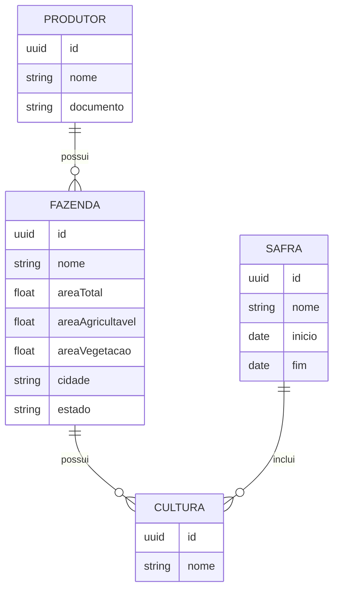
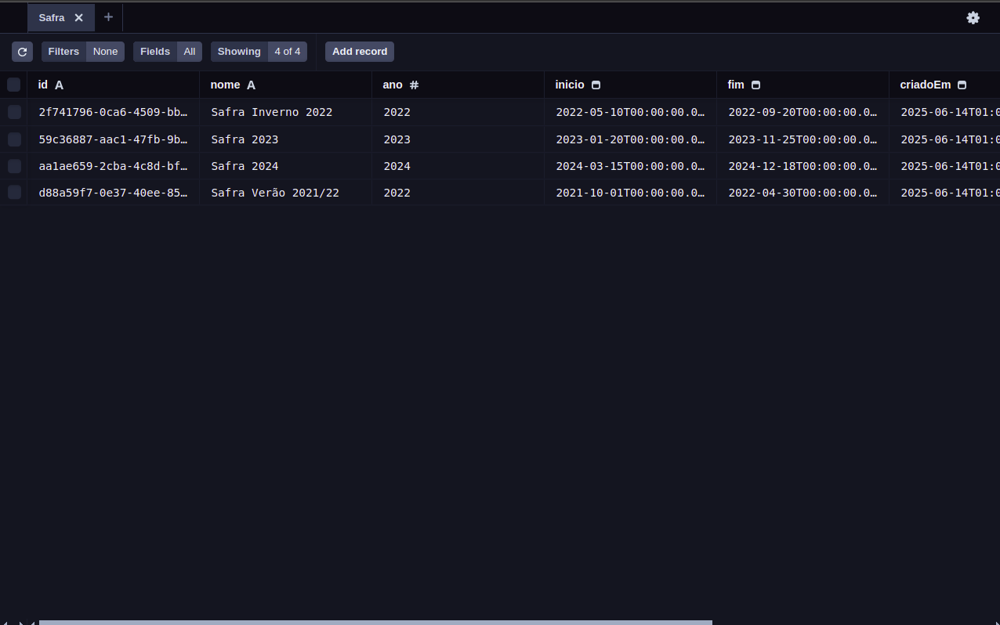
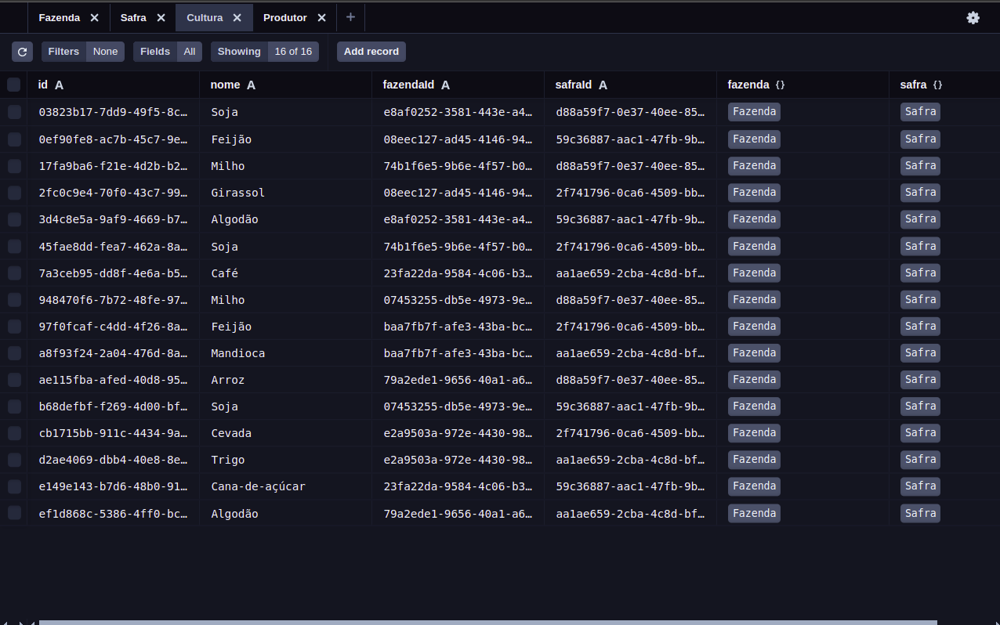
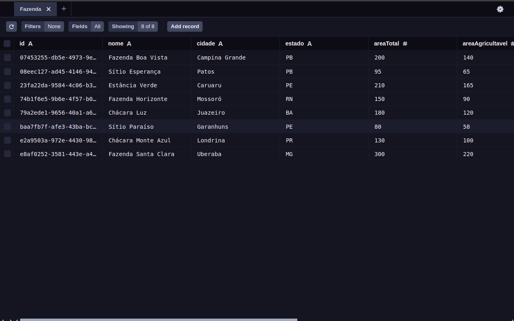
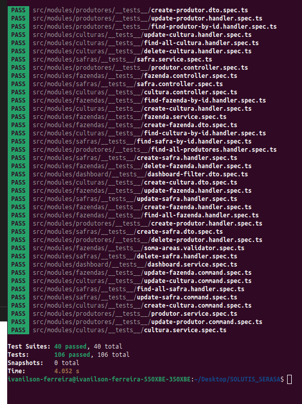
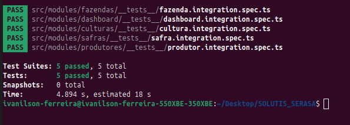
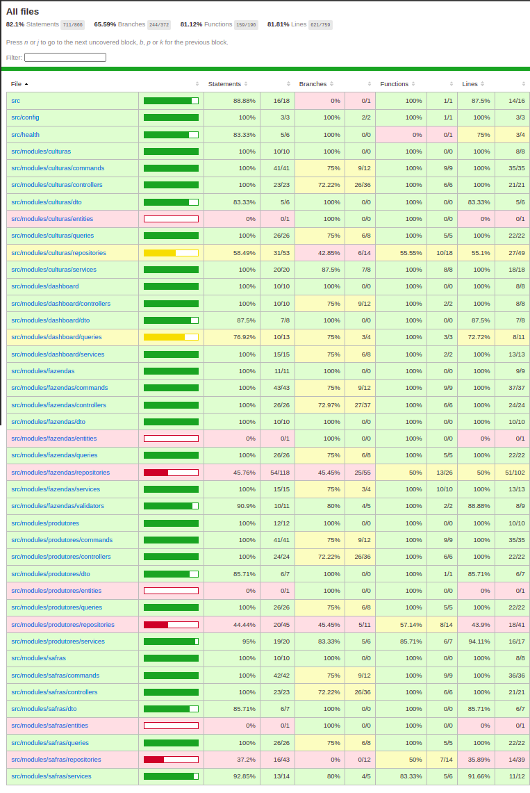
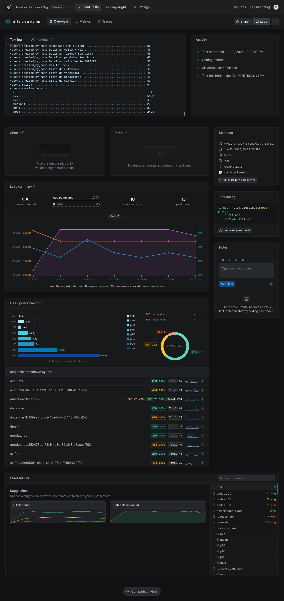

# 🚀 SOLUTIS SERASA AGRO API — Backend Enterprise-Grade

## 🏆 Backend Polido, Escalável e Testado

Este projeto foi desenvolvido como entrega para o desafio técnico da **Solutis / Serasa Experian**, seguindo rigorosamente padrões de excelência em backend:

- 🔥 Escalabilidade
- 🧠 Clareza arquitetural
- 💎 Manutenibilidade
- 🚀 Performance
- 🧪 Testes completos
- 🔐 Robustez de produção

---

## 🔧 Tecnologias e Arquitetura

| Tecnologia            | Descrição                                                                 |
| --------------------- | ------------------------------------------------------------------------- |
| **NestJS**            | Framework backend com arquitetura modular, CQRS e injeção de dependências |
| **Prisma ORM**        | ORM robusto, migrations seguras e tipagem estrita                         |
| **PostgreSQL**        | Banco de dados relacional                                                 |
| **Docker + Compose**  | Infraestrutura local e deploy                                             |
| **Artillery**         | Stress test e validação de performance                                    |
| **Jest**              | Testes unitários e integração                                             |
| **TypeDoc**           | Documentação técnica automática                                           |

---

## 🏛️ Arquitetura Aplicada

- 🏗️ **Domain-Driven Design (DDD) tático**
- 🧠 **CQRS completo:** Commands (escrita) e Queries (leitura) separados
- 📦 **Repository Pattern:** Prisma para produção, InMemory para testes
- 🚀 **Injeção de dependências:** Providers e `useClass`
- 🧪 **Testabilidade :** Unitários + integração + validadores
- 🏹 **Documentação gerada automaticamente com TypeDoc**

---

## 🗺️ Diagrama Entidade-Relacionamento (ER)


🔍 **Exemplos das tabelas no banco:**

<p align="center">
  
</p>

<p align="center">
  
</p>

<p align="center">
  
</p>

---

## 🌾 Domínios Modelados

- 👨‍🌾 **Produtores**
- 🏡 **Fazendas**
- 📅 **Safras**
- 🌱 **Culturas**
- 📊 **Dashboard (métricas)**

---

## 🧠 Regras de Negócio

| Domínio     | Regras Implementadas                                                                                                                                 |
| ------------| ------------------------------------------------------------------------------------------------------------------------------------------------------ |
| **Produtores** | Documento único (`documento`), CRUD completo                                                                                                     |
| **Fazendas**   | Soma (`areaAgricultavel + areaVegetacao`) não pode exceder `areaTotal`. Cidade e estado obrigatórios. CRUD completo                              |
| **Safras**     | Datas `inicio` e `fim` obrigatórias e consistentes. CRUD completo                                                                                 |
| **Culturas**   | Nome único dentro da safra. Pode repetir em safras diferentes. Associação obrigatória com Fazenda e Safra. CRUD completo                          |
| **Dashboard**  | Filtros por estado, cultura, área e busca textual. Métricas de total, soma de hectares, agrupamento por estado, cultura e uso do solo.            |

---

## 📊 Dashboard — Filtros e Métricas

| Filtro      | Descrição                                  | Exemplo      |
| ------------|--------------------------------------------|--------------|
| `estado`    | Filtra fazendas por estado                 | `SP`         |
| `cultura`   | Filtra agrupamento de culturas             | `Soja`       |
| `areaMin`   | Filtra fazendas com área mínima            | `100`        |
| `areaMax`   | Filtra fazendas com área máxima            | `1000`       |
| `search`    | Busca texto em nome, cidade ou estado      | `Campinas`   |

---

## 🚀 Endpoints Principais

| Método | Rota                      | Descrição                                      |
| ------ | -------------------------- | ----------------------------------------------- |
| `GET`  | `/produtores`              | Lista produtores                               |
| `POST` | `/produtores`              | Cria produtor                                  |
| `GET`  | `/produtores/:id`          | Detalha produtor                               |
| `PUT`  | `/produtores/:id`          | Atualiza produtor                              |
| `DELETE`| `/produtores/:id`         | Remove produtor                                |
| `GET`  | `/dashboard/metrics`       | Retorna métricas com filtros                   |
| ...    | `/fazendas`, `/safras`, `/culturas` | CRUD completo para todas as entidades |

---

## 🧪 Testes — Cobertura Profissional

- ✅ **Unitários:** Handlers, Services, Validators, Commands, Queries
<p align="center">
  
</p>

- ✅ **Integração:** CRUD completo para cada entidade
<p align="center">
  
</p>

- ✅ **Validação:** DTOs testados para sucesso e erros

- ✅ **Dashboard:** Cobertura total dos filtros e métricas

- ✅ **Testes async:** Mocks usando `jest.MockResolvedValue`

- ✅ **Coverage limpa:** Exclui `dist`, `node_modules`, migrations
<p align="center">
  
</p>


---

## 🚥 Health Check

| Endpoint     | Descrição                             |
| -------------| ------------------------------------- |
| `GET /health`| ✅ API operante (retorna `{ "status": "ok" }`) |

---

## 🐳 Setup Local com Docker

```bash
# Clone o repositório
git clone https://github.com/IvanFerroli/Brain-Agriculture.git

# Acesse a pasta
cd Brain-Agriculture

# Suba o ambiente
docker-compose up -d

# Instale as dependências
npm install

# Execute migrations e seed
npx prisma migrate deploy
npx prisma db seed

# Rode a aplicação
npm run start:dev
```

Acesse:

- API → http://localhost:3000
- PgAdmin → http://localhost:5050

---

## 🗂️ Estrutura de Pastas

```bash
src
├── app.module.ts
├── config
│   └── env.validation.ts
├── health
│   └── health.controller.ts
├── main.ts
└── modules
    ├── culturas
    │   ├── commands
    │   │   ├── create-cultura.command.ts
    │   │   ├── create-cultura.handler.ts
    │   │   ├── delete-cultura.command.ts
    │   │   ├── delete-cultura.handler.ts
    │   │   ├── index.ts
    │   │   ├── update-cultura.command.ts
    │   │   └── update-cultura.handler.ts
    │   ├── controllers
    │   │   └── cultura.controller.ts
    │   ├── cultura.module.ts
    │   ├── dto
    │   │   ├── create-cultura.dto.ts
    │   │   └── index.ts
    │   ├── entities
    │   │   └── cultura.entity.ts
    │   ├── queries
    │   │   ├── find-all-cultura.handler.ts
    │   │   ├── find-all-cultura.query.ts
    │   │   ├── find-cultura-by-id.handler.ts
    │   │   ├── find-cultura-by-id.query.ts
    │   │   └── index.ts
    │   ├── repositories
    │   │   ├── cultura.repository.ts
    │   │   ├── index.ts
    │   │   ├── in-memory-cultura.repository.ts
    │   │   └── prisma-cultura.repository.ts
    │   ├── services
    │   │   └── cultura.service.ts
    │   └── __tests__
    │       ├── create-cultura.command.spec.ts
    │       ├── create-cultura.dto.spec.ts
    │       ├── create-cultura.handler.spec.ts
    │       ├── cultura.controller.spec.ts
    │       ├── cultura.integration.spec.ts
    │       ├── cultura.service.spec.ts
    │       ├── delete-cultura.handler.spec.ts
    │       ├── find-all-cultura.handler.spec.ts
    │       ├── find-cultura-by-id.handler.spec.ts
    │       ├── update-cultura.command.spec.ts
    │       └── update-cultura.handler.spec.ts
    ├── dashboard
    │   ├── controllers
    │   │   └── dashboard.controller.ts
    │   ├── dashboard.module.ts
    │   ├── dto
    │   │   ├── dashboard-filter.dto.ts
    │   │   └── index.ts
    │   ├── queries
    │   │   ├── get-dashboard-metrics.handler.ts
    │   │   ├── get-dashboard-metrics.query.ts
    │   │   └── index.ts
    │   ├── services
    │   │   └── dashboard.service.ts
    │   └── __tests__
    │       ├── dashboard-filter.dto.spec.ts
    │       ├── dashboard.integration.spec.ts
    │       └── dashboard.service.spec.ts
    ├── fazendas
    │   ├── commands
    │   │   ├── create-fazenda.command.ts
    │   │   ├── create-fazenda.handler.ts
    │   │   ├── delete-fazenda.command.ts
    │   │   ├── delete-fazenda.handler.ts
    │   │   ├── index.ts
    │   │   ├── update-fazenda.command.ts
    │   │   └── update-fazenda.handler.ts
    │   ├── controllers
    │   │   └── fazenda.controller.ts
    │   ├── dto
    │   │   ├── create-fazenda.dto.ts
    │   │   └── index.ts
    │   ├── entities
    │   │   └── fazenda.entity.ts
    │   ├── fazenda.module.ts
    │   ├── queries
    │   │   ├── find-all-fazenda.handler.ts
    │   │   ├── find-all-fazenda.query.ts
    │   │   ├── find-fazenda-by-id.handler.ts
    │   │   ├── find-fazenda-by-id.query.ts
    │   │   └── index.ts
    │   ├── repositories
    │   │   ├── fazenda.repository.ts
    │   │   ├── index.ts
    │   │   ├── in-memory-fazenda.repository.ts
    │   │   └── prisma-fazenda.repository.ts
    │   ├── services
    │   │   └── fazenda.service.ts
    │   ├── __tests__
    │   │   ├── create-fazenda.dto.spec.ts
    │   │   ├── create-fazenda.handler.spec.ts
    │   │   ├── delete-fazenda.handler.spec.ts
    │   │   ├── fazenda.controller.spec.ts
    │   │   ├── fazenda.integration.spec.ts
    │   │   ├── fazenda.service.spec.ts
    │   │   ├── find-all-fazenda.handler.spec.ts
    │   │   ├── find-fazenda-by-id.handler.spec.ts
    │   │   ├── soma-areas.validator.spec.ts
    │   │   ├── update-fazenda.command.spec.ts
    │   │   └── update-fazenda.handler.spec.ts
    │   └── validators
    │       └── soma-areas.validator.ts
    ├── prisma
    │   ├── migrations
    │   │   ├── 20250610192457_init
    │   │   ├── 20250613004719_init
    │   │   ├── 20250613115837_add_inicio_e_fim_safra
    │   │   └── migration_lock.toml
    │   ├── prisma.module.ts
    │   ├── prisma.service.ts
    │   ├── schema.prisma
    │   └── seed.ts
    ├── produtores
    │   ├── commands
    │   │   ├── create-produtor.command.ts
    │   │   ├── create-produtor.handler.ts
    │   │   ├── delete-produtor.command.ts
    │   │   ├── delete-produtor.handler.ts
    │   │   ├── index.ts
    │   │   ├── update-produtor.command.ts
    │   │   └── update-produtor.handler.ts
    │   ├── controllers
    │   │   └── produtor.controller.ts
    │   ├── dto
    │   │   ├── create-produtor.dto.ts
    │   │   └── index.ts
    │   ├── entities
    │   │   └── produtor.entity.ts
    │   ├── produtor.module.ts
    │   ├── queries
    │   │   ├── find-all-produtores.handler.ts
    │   │   ├── find-all-produtores.query.ts
    │   │   ├── find-produtor-by-id.handler.ts
    │   │   ├── find-produtor-by-id.query.ts
    │   │   └── index.ts
    │   ├── repositories
    │   │   ├── index.ts
    │   │   ├── in-memory-produtor.repository.ts
    │   │   ├── prisma-produtor.repository.ts
    │   │   └── produtor.repository.ts
    │   ├── services
    │   │   └── produtor.service.ts
    │   └── __tests__
    │       ├── create-produtor.dto.spec.ts
    │       ├── create-produtor.handler.spec.ts
    │       ├── delete-produtor.handler.spec.ts
    │       ├── find-all-produtores.handler.spec.ts
    │       ├── find-produtor-by-id.handler.spec.ts
    │       ├── produtor.controller.spec.ts
    │       ├── produtor.integration.spec.ts
    │       ├── produtor.service.spec.ts
    │       ├── update-produtor.command.spec.ts
    │       └── update-produtor.handler.spec.ts
    └── safras
        ├── commands
        │   ├── create-safra.command.ts
        │   ├── create-safra.handler.ts
        │   ├── delete-safra.command.ts
        │   ├── delete-safra.handler.ts
        │   ├── index.ts
        │   ├── update-safra.command.ts
        │   └── update-safra.handler.ts
        ├── controllers
        │   └── safra.controller.ts
        ├── dto
        │   ├── create-safra.dto.ts
        │   └── index.ts
        ├── entities
        │   └── safra.entity.ts
        ├── queries
        │   ├── find-all-safra.handler.ts
        │   ├── find-all-safra.query.ts
        │   ├── find-safra-by-id.handler.ts
        │   ├── find-safra-by-id.query.ts
        │   └── index.ts
        ├── repositories
        │   ├── index.ts
        │   ├── in-memory-safra.repository.ts
        │   ├── prisma-safra.repository.ts
        │   └── safra.repository.ts
        ├── safra.module.ts
        ├── services
        │   └── safra.service.ts
        └── __tests__
            ├── create-safra.dto.spec.ts
            ├── create-safra.handler.spec.ts
            ├── delete-safra.handler.spec.ts
            ├── find-all-safra.handler.spec.ts
            ├── find-safra-by-id.handler.spec.ts
            ├── safra.controller.spec.ts
            ├── safra.integration.spec.ts
            ├── safra.service.spec.ts
            ├── update-safra.command.spec.ts
            └── update-safra.handler.spec.ts

52 directories, 151 files

```

---

## 🔍 Documentação Técnica (TypeDoc)

<p align="center">
  
</p>

```bash
npx typedoc
```
```bash
npx serve docs
```

Acesse:

```
http://localhost:3000
```

---

## 🚀 Performance e Stress Test

- ✅ **Artillery:** 600 requisições/min sem erro, p95 < 5ms
- ✅ Teste GET, Listagens, Dashboard e filtros
- ✅ UUIDs reais usados no teste (sem erro 404)
- ✅ Testes de stress documentados no README e com print do terminal

<p align="center">
  
</p>

---

## 📦 Seed de Dados 

- 5 Produtores
- 8 Fazendas (vários estados, cidades, áreas)
- 4 Safras (anos distintos, com início e fim)
- 16 Culturas (associadas a safra e fazenda)

🧠 O seed simula cenários reais, variados, prontos para testes, dashboards e validação de performance.

